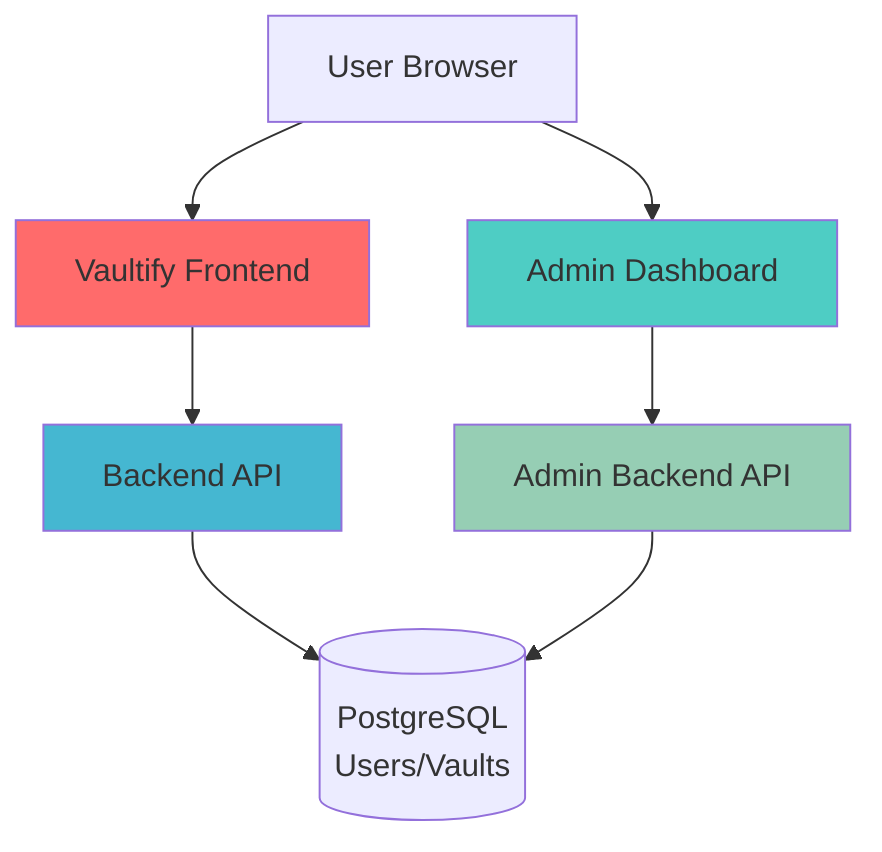

# 🔐 VAULTIFY - Self-Hosted Encrypted Password Manager


## 🎯 Overview

Vaultify is a comprehensive, self-hosted password management solution featuring **end-to-end client-side encryption**. All sensitive data is encrypted using **AES-256-GCM** before ever reaching our servers, ensuring complete privacy and security.

### 🛡️ Security-First Architecture
- **Zero-Knowledge Design**: We never see your master password or decrypted data
- **Client-Side Encryption**: All encryption/decryption happens in your browser
- **Military-Grade Crypto**: AES-256, PBKDF2 key derivation, and secure TOTP implementation

---

## 📦 Project Structure

```
vaultify/
├── 🚀 backend/                 # Main Express API (User operations)
├── 🛡️ backend-admin/          # Admin Express API (Management operations)  
├── 💫 vaultify/               # Main User Application (React + Vite)
├── 👑 vaultify-admin/         # Admin Dashboard (React + Vite)
└── 📚 Documentation/
```

## 🏗️ System Architecture



---

## ✨ Core Features

### 🔐 **User Application (vaultify/)**
| Feature | Status | Description |
|---------|--------|-------------|
| **AES-256 Vault Encryption** | ✅ | Client-side encryption before data leaves browser |
| **Secure Card Storage** | ✅ | Separate encryption for payment cards |
| **PBKDF2 Key Derivation** | ✅ | 250,000 iterations for master key |
| **2FA (TOTP) Support** | ✅ | Google Authenticator compatible |
| **Premium Feature System** | ✅ | Activation key-based premium access |
| **Breach Scanner** | ✅ | HaveIBeenPwned API integration |
| **Password Generator** | ✅ | Secure random password creation |
| **Cyberpunk UI Theme** | ✅ | Dark theme with neon accents |
| **Auto-Save & Sync** | ✅ | Real-time vault synchronization |

### 👑 **Admin Dashboard (vaultify-admin/)**
| Feature | Status | Description |
|---------|--------|-------------|
| **User Management** | ✅ | View and manage all registered users |
| **Premium Control** | ✅ | Grant/revoke premium access |
| **2FA Reset** | ✅ | Emergency 2FA disable for users |
| **Premium Key Generation** | ✅ | Create new activation keys |
| **System Analytics** | ✅ | User statistics and system health |
| **Admin Authentication** | ✅ | Secure admin login system |

### ⚙️ **Backend Services**
| Service | Port | Purpose |
|---------|------|---------|
| **Main Backend** | :5000 | User authentication, vault operations, 2FA |
| **Admin Backend** | :5001 | User management, premium controls, system admin |

---

## 🚀 Quick Start

### Prerequisites
- **Node.js** 18.0+ 
- **PostgreSQL** 14.0+
- **npm** package manager

### 1️⃣ Clone & Setup

```bash
# Clone repository
git clone https://github.com/NeoLynX-here/vaultify.git
cd vaultify

# Install all dependencies (run in each directory)
cd vualtify
npm install

cd ../backend
npm install

cd ../vaultify-admin
npm install

cd ../backend-admin
npm install
```

### 2️⃣ Database Configuration

```sql
-- Run schema setup
psql -U postgres -d vaultify -f vault.sql
```

### 3️⃣ Environment Configuration

**Backend (.env)**
```env
# Database
DB_USER=vaultuser
DB_PASS=your_secure_password
DB_HOST=localhost
DB_PORT=5432
DB_NAME=vaultify

# JWT Security
JWT_SECRET=your_super_secure_jwt_secret_here

# Admin Credentials
ADMIN_USER=YourAdminUserName
ADMIN_PASS=YourSecureAdminPass123!

```

**Frontend (/util/api.js)**
```js
API_BASE = "http://localhost:5000/api" 
API_BASE = "http://localhost:5001/api" // admin
```

### 4️⃣ Start Development Servers

```bash
# Terminal 1 - Main Backend
cd backend
npm run dev

# Terminal 2 - Admin Backend  
cd backend-admin
npm run dev

# Terminal 3 - User Application
cd vaultify
npm run dev

# Terminal 4 - Admin Dashboard
cd vaultify-admin
npm run dev
```

### 5️⃣ Access Applications

| Application | URL | Default Credentials |
|-------------|-----|---------------------|
| **User App** | http://localhost:5173 | Register new account |
| **Admin Dashboard** | http://localhost:5174 | YourAdminUserName / YourSecureAdminPass123! |

---

## 🗄️ Database Schema

### Core Tables
```sql
users (
  id UUID PRIMARY KEY,
  email VARCHAR UNIQUE,
  master_hash VARCHAR,
  salt,
  vault_data TEXT,           -- Encrypted client-side
  card_data TEXT,            -- Encrypted client-side  
  is_premium BOOLEAN,
  premium_key VARCHAR,
  totp_secret VARCHAR,
  is_totp_enabled BOOLEAN
);

twofa_tickets (
  id UUID PRIMARY KEY,
  user_id UUID REFERENCES users(id),
  ticket_code VARCHAR,
  is_used BOOLEAN,
  expires_at TIMESTAMP
);

```

---

## 🔐 Security Implementation

### Encryption Architecture
```javascript
// Client-Side Encryption Flow
masterPassword → PBKDF2(100,000 iterations) → vaultKey → AES-256-GCM(vaultData)

// Data never transmitted in plaintext
encryptedVault → Server → Database
```

### Security Features
- ✅ **Zero-Knowledge Architecture**
- ✅ **Client-Side AES-256-GCM Encryption**
- ✅ **PBKDF2 Key Stretching** (100,000+ iterations)
- ✅ **JWT Authentication** with secure httpOnly cookies
- ✅ **TOTP 2FA Support**
- ✅ **CSP Headers** & XSS Protection
- ✅ **SQL Injection Prevention** (Parameterized queries)
- ✅ **Rate Limiting** on authentication endpoints

---

## 🎨 UI/UX Features

### User Interface
- **Cyberpunk Aesthetic**: Dark theme with neon blue/purple accents
- **Fully Responsive**: Responsive design approach
- **Smooth Animations**: CSS transitions and micro-interactions

### Admin Dashboard
- **Real-time Analytics**: User metrics and system monitoring
- **Bulk Operations**: Multi-user management
- **Audit Logging**: Track admin activities
- **Responsive Design**: Mobile-friendly admin interface

---

## 📡 API Endpoints

### User Backend (/:5000)
| Method | Endpoint | Description |
|--------|----------|-------------|
| `POST` | `/api/auth/register` | User registration |
| `POST` | `/api/auth/login` | User authentication |
| `POST` | `/api/auth/verify-2fa` | 2FA verification |
| `GET`  | `/api/vault` | Get encrypted vault |
| `POST` | `/api/vault` | Save encrypted vault |
| `POST` | `/api/cards` | Save encrypted cards |
| `POST` | `/api/premium/verifyPremium` | Activate premium |

### Admin Backend (/:5001)
| Method | Endpoint | Description |
|--------|----------|-------------|
| `POST` | `/api/admin/login` | Admin authentication |
| `GET`  | `/api/admin/users` | Get all users |
| `PUT`  | `/api/admin/users/:id/premium` | Toggle premium |
| `POST` | `/api/admin/premium-keys` | Generate premium keys |
| `POST` | `/api/admin/reset-2fa/:userId` | Reset user 2FA |

---

## 🚀 Deployment

### Production Build
```bash

npm run build

```

### Environment Variables Checklist
- [ ] Strong JWT secrets
- [ ] Secure database credentials
- [ ] Custom admin credentials
- [ ] Proper CORS origins
- [ ] HTTPS in production

---


## 🔧 Troubleshooting

### Common Issues

1. **Database Connection Failed**
   ```bash
   # Check PostgreSQL service
   sudo systemctl status postgresql
   
   # Verify connection string
   psql -U vaultuser -d vaultify -h localhost
   ```

2. **Port Already in Use**
   ```bash
   # Find and kill process
   lsof -ti:3000 | xargs kill -9
   ```

3. **Build Errors**
   ```bash
   # Clear cache and reinstall
   rm -rf node_modules package-lock.json
   npm install
   ```

---

## 🤝 Contributing

We welcome contributions! Please see our [Contributing Guide](CONTRIBUTING.md) for details.

1. Fork the repository
2. Create a feature branch (`git checkout -b feature/amazing-feature`)
3. Commit your changes (`git commit -m 'Add amazing feature'`)
4. Push to the branch (`git push origin feature/amazing-feature`)
5. Open a Pull Request

### Development Guidelines
- Follow React best practices
- Maintain TypeScript types where applicable
- Write comprehensive tests
- Update documentation accordingly

---

## 📄 License

This project is licensed under the MIT License - see the [LICENSE](LICENSE) file for details.

---

## 🛣️ Roadmap

### Upcoming Features
- [ ] **Mobile App** (React Native)
- [ ] **Browser Extension**
- [ ] **Biometric Authentication**
- [ ] **Emergency Access** 
- [ ] **Secure File Storage**
- [ ] **Advanced Sharing** (end-to-end encrypted)
- [ ] **Self-Hosted Sync Server**

### Version Planning
- **v1.1**: Browser extension + mobile app
- **v1.2**: Advanced sharing features
- **v2.0**: Enterprise features + teams

---

## 📞 Support & Community

- **Documentation**: [docs.vaultify.com](https://docs.vaultify.com)
- **Issues**: [GitHub Issues](https://github.com/NeoLynX-here/vaultify/issues)
- **Discussions**: [GitHub Discussions](https://github.com/NeoLynX-here/vaultify/discussions)

---

## 🙏 Acknowledgments

- **Web Crypto API** for secure client-side encryption
- **PostgreSQL** for reliable data storage
- **React & Vite** teams for excellent developer experience
- **TailwindCSS** for utility-first styling
- **HaveIBeenPwned** for breach data

---

<div align="center">

**⭐ Star us on GitHub if you find this project useful!**

*Built with ❤️ and 🔐 for the security-conscious community*

</div>
